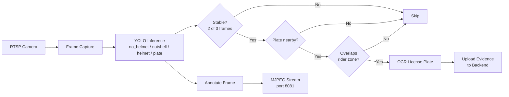

# SafeRide

AI-powered motorcycle helmet compliance detection platform for Traffic Management Centers. Built with Python, Django, React, and YOLO.

## Features

- **Real-Time Detection** — YOLOv8/v11 inference on live RTSP CCTV streams, detecting no-helmet, nutshell (non-compliant), helmet, and license plates
- **Spatial Validation** — Violations are only flagged when a rider-less person has an associated license plate in the same zone, rejecting pedestrians
- **License Plate OCR** — EasyOCR with Philippine plate format normalization (AAA1234, 1234ABC, etc.)
- **Live Monitor** — Real-time MJPEG stream from cameras directly in the dashboard
- **Evidence Management** — Automatic evidence capture (annotated frame + plate crop) per violation
- **Multi-Camera Support** — Manage unlimited cameras with independent RTSP streams and heartbeat monitoring
- **Role-Based Access** — Admin and operator roles with granular permissions (view violations, manage cameras, export reports, etc.)
- **Report Export** — Generate CSV, XLSX, or PDF reports with TMC branding and summary cards
- **Dashboard Analytics** — Charts, violation summaries, weekly trends, and camera status overview
- **Google OAuth + JWT** — Secure authentication with Google sign-in and JWT token refresh
- **Dark/Light Theme** — Per-user theme preference with system-aware default

## Detection Flow



## Tech Stack

| Layer | Technology |
|---|---|
| AI Service | Python, Ultralytics YOLO, OpenCV, EasyOCR, PyTorch |
| Backend | Python, Django 4.2, Django REST Framework |
| Database | MySQL 8 |
| Auth | JWT (SimpleJWT), Google OAuth, reCAPTCHA |
| Frontend | React 18, TypeScript, Vite 7, Tailwind CSS 3, shadcn/ui |
| Charts | Recharts, Three.js |
| Export | ReportLab (PDF), OpenPyXL (XLSX), CSV |

## Architecture

```
yolo_service/          AI detection pipeline (YOLO + OCR)
  main.py              Entry point — multi-threaded detection engine
  detection.py         Box overlap filtering
  ocr.py               License plate OCR (EasyOCR)
  backend_api.py       HTTP client for Django backend
  mjpeg_server.py      MJPEG live stream server
  weights/             Custom YOLO model weights

backend/               Django REST API
  saferide_backend/    Project settings, routing, pagination
  cameras/             Camera CRUD, heartbeats, system settings
  violations/          Violation records, exports, charts, evidence
  users/               Auth, profiles, permissions, notifications

frontend/              React admin dashboard
  src/pages/           Route components (Dashboard, Violations, Cameras, etc.)
  src/services/        API clients (Axios)
  src/components/      Shared UI (shadcn/ui components)
```

## Getting Started

```bash
git clone https://github.com/ToffDarell/SAFERIDEWEB.git
cd SAFERIDEWEB
```

### 1. Backend

```bash
cd backend
cp .env.example .env
python -m venv venv
venv\Scripts\activate    # Windows
pip install -r requirements.txt
python manage.py migrate
python manage.py runserver 0.0.0.0:8000
```

### 2. YOLO Service

```bash
cd yolo_service
cp .env.example .env     # Configure RTSP URL, API key, etc.
python -m venv venv
venv\Scripts\activate
pip install -r requirements.txt
python main.py
```

### 3. Frontend

```bash
cd frontend
npm install
npm run dev
```

## API Endpoints

| Method | Endpoint | Purpose |
|---|---|---|
| POST | `/api/auth/token/` | JWT login |
| POST | `/api/auth/google/` | Google OAuth login |
| GET | `/api/cameras/` | List cameras |
| POST | `/api/cameras/{id}/heartbeat/` | Camera heartbeat |
| GET/PATCH | `/api/settings/` | System settings |
| GET | `/api/violations/` | List violations |
| POST | `/api/violations/` | Create violation (YOLO) |
| GET | `/api/violations/summary/` | Stats summary |
| GET | `/api/violations/weekly-chart/` | Chart data |
| GET | `/api/violations/export/` | Export report |

## License

Proprietary — All rights reserved.
